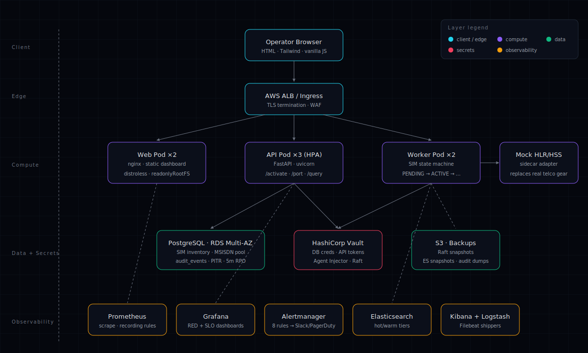

# SIM Provisioning Automation Platform

[](https://github.com/itm-skills/sim-prov/actions/workflows/ci.yml)
[](#license)
[](k8s/)
[](terraform/)

Production-shaped, IaC-driven SIM provisioning platform: a FastAPI activation
service, async state-machine worker, mock HLR sidecar, and a single-page
operator console — wrapped in the full DevOps lifecycle.

> Case Study 20 · ITM Skills University · B.Tech CSE 2024-28 · DevOps Sem IV

## Architecture



## Quickstart

```bash
make up           # build + start the local stack
make vault-bootstrap   # seed Vault policies + secrets (one-time)
make seed         # load sample SIMs and plans
make smoke        # hit the API and assert JSON shape
```

Then open:

| Surface     | URL                              | Notes                           |
| ----------- | -------------------------------- | ------------------------------- |
| Frontend    | <http://localhost:5173>          | Operator console                |
| API docs    | <http://localhost:8000/docs>     | FastAPI Swagger                 |
| Grafana     | <http://localhost:3001>          | admin / admin                   |
| Prometheus  | <http://localhost:9090>          | targets, rules                  |
| Alertmanager| <http://localhost:9093>          |                                 |
| Kibana      | <http://localhost:5601>          | import the bundled dashboard    |
| Vault       | <http://localhost:8200>          | token: `root-dev-token`         |

## Deliverables checklist

| Layer            | Files                                                                      |
| ---------------- | -------------------------------------------------------------------------- |
| Application      | `app/backend/`, `app/frontend/` *(owned by app agent)*                     |
| Containerization | `docker/Dockerfile.api`, `docker/Dockerfile.worker`, `docker/Dockerfile.mock-hlr`, `docker/Dockerfile.frontend`, `docker/nginx.conf`, `docker-compose.yml` |
| CI/CD            | `jenkins/Jenkinsfile`, `.github/workflows/ci.yml`, `.github/workflows/release.yml` |
| IaC              | `terraform/envs/prod/`, `terraform/modules/{vpc,eks,rds}/`                 |
| Orchestration    | `k8s/base/`, `k8s/overlays/prod/`                                          |
| Monitoring       | `monitoring/prometheus/`, `monitoring/alertmanager/`, `monitoring/grafana/`|
| Logging          | `logging/elk/`, `logging/logstash/`, `logging/kibana/`, `logging/filebeat/`|
| Secrets          | `vault/policies/`, `vault/config/`, `vault/scripts/bootstrap.sh`           |
| Diagrams + docs  | `docs/` *(owned by docs agent)*                                            |

## How the pieces fit

```
  ┌─ frontend (nginx) ──► api (FastAPI) ──► postgres
                                    └─► mock-hlr ──► worker (state machine)
  prometheus ◄── scrape ── api/worker/mock-hlr/postgres-exporter
  filebeat ──► logstash ──► elasticsearch ──► kibana
  vault ── injector ──► api & worker pods (DB creds, HLR key)
```

## Team

| Role               | Name                    |
| ------------------ | ----------------------- |
| Platform & DevOps  | Sayuj Pillai            |
| Application        | *(see app/README.md)*   |
| Documentation      | *(see docs/README.md)*  |

## License

MIT — see [`LICENSE`](LICENSE) (academic submission, no warranty).
